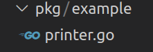

# template-go

A template to create a simple go project. The structure in this repository is meant to be easily extensible and to allow quick-start of a go application with internal packages and configuration.

# Installation

- Clone the repo: `git clone git@github.com:Knoblauchpilze/template-go.git`.
- Install Go from [here](https://go.dev/doc/install). **NOTE**: this project expects Go 1.20 to be available on the system.
- Go to the project's directory `cd ~/path/to/the/repo`.
- Compile and install: `make`.
- Execute any application with `make run app_name`.

# General principle

This repository is divided into multiple sub-folders, each one having its own purpose. The structure is heavily inspired from the template project available in this [repository](https://github.com/golang-standards/project-layout).

This is the list of the folders that we kept:
* [assets](https://github.com/Knoblauchpilze/template-go/tree/master/assets): holds all the resources for the project (images, logo, etc.).
* [bin](https://github.com/Knoblauchpilze/template-go/tree/master/bin): the executables.
* [cmd](https://github.com/Knoblauchpilze/template-go/tree/master/cmd): the list of applications defined by the project.
* [configs](https://github.com/Knoblauchpilze/template-go/tree/master/configs): configuration file templates or defaults.
* [internal](https://github.com/Knoblauchpilze/template-go/tree/master/internal): packages which we don't want to publish or make available to the public but are still needed by this project.
* [pkg](https://github.com/Knoblauchpilze/template-go/tree/master/pkg): the public packages which are defined by this project and can be reused.
* [scripts](https://github.com/Knoblauchpilze/template-go/tree/master/scripts): the list of scripts/tools used by this project.
* [test](https://github.com/Knoblauchpilze/template-go/tree/master/test): where tests are stored.

# How to extend this project

## Adding more packages

The [pkg](https://github.com/Knoblauchpilze/template-go/tree/master/pkg) is where you want to go. This allows to easily group features by topic and reference them in the applications.

For example let's say the user wants to create a package called `example` and used it in an app called `cli`. From the folder perspective, a new package is created like this:



Then in the [printer.go](pkg/example/printer.go) file, this is how the code could look:
```go
package example

func func1() {
  /* do something */
}
```

To reference this in the [cli](cmd/cli) app, this is how it could look:
```go
package main

import "github.com/KnoblauchPilze/template-go/pkg/example"

func main() {
	example.PrintHelloWorld("cli")
}
```

## Adding an application

Apps are stored in the [cmd](cmd) folder. Each application has its own directory: this eases the separation of concerns.

This project comes with an example app called [cli](cmd/cli) which doesn't do much.

In order to make things easy, a [Makefile](cmd/cli/Makefile) is provided to compile the app. This `Makefile` is also able to install the result of the compilation of the application in the top level `bin` folder so that it can easily be executed.

So a typical example would be to develop in the [cmd/cli](cmd/cli) folder, and when the user is satistifed with the result it can install the app through running `make install`. This will 'publish' the application in the root `bin` folder: the binary can then be used by other applications or to perform operations.

## Tests

Tests in go are usually done by creating a test file at the same location as the package to test. This template project comes with an example package and a test in [pkg/example](pkg/example).

A convenience target to run all tests is provided in the top level [Makefile](Makefile) under `make test`. Running this command will execute all the tests defined in the [internal](internal) and [pkg](pkg) folders.

Adding a test is just a question of adding the corresponding `yourModule_test.go` file.

The [test](test) folder can be used to store some test data or external tooling used to assess the behavior of applications or packages. This is generally not a place where tests' bodies should be written.
