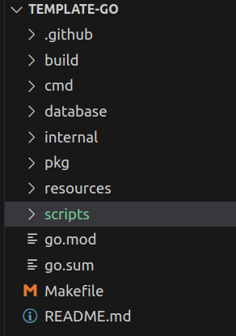
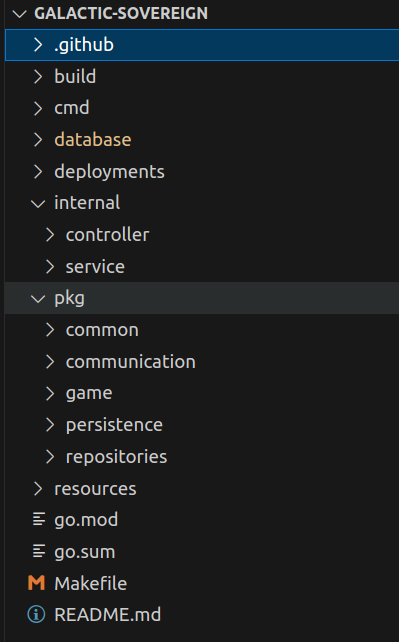
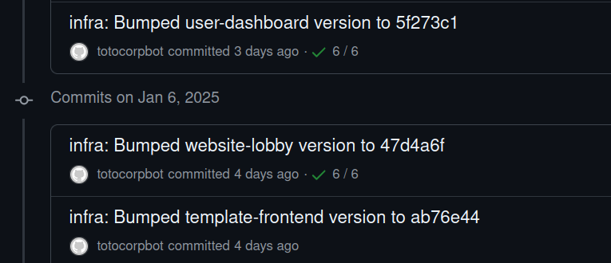

# template-go

This repository defines a scaffolding project to kick-start a back-end application. It is meant to work best with a frontend service created using the [template-frontend](https://github.com/Knoblauchpilze/template-frontend).

# Why this project?

When building a back-end service, it is common to have to solve the same problems. This includes, among other things:
* starting a server listening to incoming connections to serve requests.
* interfacing with a database to get and save data.
* publishing the service's code to a docker image that can be deployed in a cluster
* etc.

Those operations are usually quite similar from one service to the next. This is where this repository comes into play: by using it, you can kick-start a new back-end service in an instance, by using a scaffolding that provides most of the boilerplate you will need.

# What does this repository provide?

By using this repository and adapting it for a new project you will get, out of the box:
* a working server which you can extend with your own endpoints.
* a working CI, which allows to verify your work, run your tests and publish the result of your implementation.
* a way to make the service available in `dockerhub` through a docker image.
* the possibility to deploy automatically a new version of the service to a cluster management system.

# Badges

[](https://github.com/Knoblauchpilze/template-go/actions/workflows/build-and-push.yml)

[](https://codecov.io/gh/Knoblauchpilze/template-go)

# Installation

## Prerequisites

The tools described below are directly used by the project. It is mandatory to install them in order to build the project locally.

See the following links:

- [golang](https://go.dev/doc/install): this project was developed using go `1.23.2`.
- [golang migrate](https://github.com/golang-migrate/migrate/blob/master/cmd/migrate/README.md): following the instructions there should be enough.
- [postgresql](https://www.postgresql.org/) which can be taken from the packages with `sudo apt-get install postgresql-14` for example.
- [docker](https://docs.docker.com/engine/install/ubuntu/): this is needed in case you want to build the docker image locally.

## Cloning the repository

Once the above steps have been completed, you can clone the repository with the following command:
```bash
git clone git@github.com:Knoblauchpilze/template-go.git
```

## Secrets in the CI

The CI workflows define several secrets that are expected to be created for the repository when cloned/forked/used. Each secret should be self-explanatory based on its name. Below is a description of the ones used by this project:

| Secret             | Description |
| ------------------ | ----------- |
| CODECOV_TOKEN      | A token generated from [codecov](https://about.codecov.io/) allowing to pubilsh the code coverage reports |
| DOCKERHUB_USERNAME | Obtained from your account over at [dockerhub](https://hub.docker.com/), allows to publish the docker image of the service |
| DOCKERHUB_TOKEN    | Also taken from [dockerhub](https://hub.docker.com), this authenticates the request to publish to the repositories |
| DEPLOYMENT_TOKEN   | Used to trigger the automatic deployment of the service's latest  version over at [ec2-deployment](https://github.com/Knoblauchpilze/ec2-deployment) |

# How does this project work?

## General structure

The structure provided in this template project should allow to easily extend it. It should also allow to guide the development to add new features in a way that is consistent with best practictes.

Generally speaking it is loosely based on the [project layout](https://github.com/golang-standards/project-layout) defined in the `golang-standards`. Note that as mentioned in the Github repository it is not a **standard** per se but rather some guidelines. For having tried it this suits our needs and therefore is now present in this template.

The project layout looks as follows:



We can distinguish several groups of folders in this architecture:
* `.github` is linked to the CI.
* `build` contains the necessary elements to build a docker image of the service.
* `database` contains the definition of the databases needed by the services of the project.
* `cmd` is where the different services are living: one folder per service.
* `internal` and `pkg` are meant to hold the common code used by the services.

## The CI

The CI lives in the [.github](.github) folder and contains two main workflows:
* [build-and-push](.github/workflows/build-and-push.yml) defines the logic to build the service's docker image and publish it after the tests have passed.
* [database-migration-tests](.github/workflows/database-migration-tests.yml) verifies that the databases associated to the services are consistent and can be successfully migrated up from an empty `postgres` server.

The CI is already working and uses the secrets as defined in the dedicated [section](#secrets-in-the-ci).

# How to use this project to kick-start a new service?

## Creating secrets

The secrets needed by default by this project are described in [a previous section](#secrets-in-the-ci). If you fork/copy this repository you will have to create them and fill them with your own data.

Note that the CI by default does not try to upload the code coverage when `dependabot` creates a commit. This is because of issue [#3253](https://github.com/dependabot/dependabot-core/issues/3253): you could change this behavior and rather also create the secrets in the `Dependabot` section of the project's settings.

## Use the configure script

TODO


## Adding more packages

A typical architecture of a more 'complex' project looks like so (taken from the [galactic-sovereign](https://github.com/Knoblauchpilze/galactic-sovereign) project):



Most of the common DTOs, entities and repositories are in the `pkg` folder while the services and controllers are in `internal`. This choice can of course be challenged and adapted in your own projects.

## Adding new services

Service definitions are living in the [cmd](cmd) folder. In case you need to add a new one you can create a new folder with the name of the service.

Note that this project is more intended to keep a single service per repository: if you want to change this you will have to modify the CI to allow building and deploying multiple services.

**Note:** the `configure` script (see [this](#use-the-configure-script) section) will take care of renaming the default template service to a name of your choosing (and matching the name of the project).

## Adding new databases

Database definitions are living in the [database](database) folder. In case you need some new ones you can add them in the directory. The scripts provided in the template should allow to create/update/delete any database as they expect you to provide the path to the database to migrate.

You will also need to update the CI to account for this new database:
* in the [database-migration-tests](.github/workflows/database-migration-tests.yml): add a new step to migrate and verify the setup of the new database.
* in the [build-and-push](.github/workflows/build-and-push.yml): add a step to configure the database for services (and packages) that need it.

## Deploying the service

As mentioned in the [secrets](#secrets-in-the-ci) section, this project is configured to automatically update the deployment over at [ec2-deployment](https://github.com/Knoblauchpilze/ec2-deployment). This is achieved by:
* pushing the docker image of the service to `dockerhub`.
* triggering a commit to the `ec2-deployment` repository.

In case you have a similar workflow, it is easy to update the `DEPLOYMENT_TOKEN` to point to another repository and to modify the [CI workflow](.github/workflows/build-and-push.yml) in the `update-deployment` step to deploy to another repository.

In case you don't use `dockerhub` but another system to store the docker image (or don't use docker images at all), then you might need to rewrite part of the CI workflow (namely the `build-and-push-docker-image` step).

Once updated, this should automatically trigger a commit in the `ec2-deployment` (or any other repository) with the latest update. The commit message should be explicit enough:


